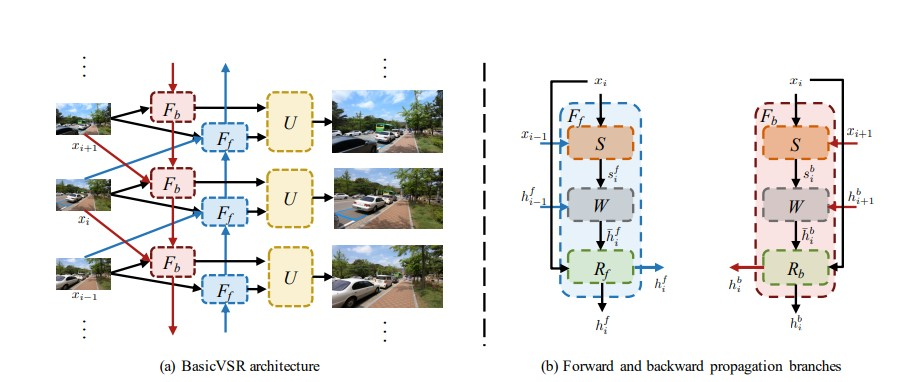

# BasicVSR Unofficial implementation 
Based on [BasicVSR](https://arxiv.org/abs/2012.02181) by Kelvin C.K. Chan, Xintao Wang, Ke Yu, Chao Dong, Chen Change Loy


<p align="center"></p>


## Description


This project is unofficial implementation of BasicVSR. BasicVSR is designed for the task of video super-resolution. The goal of video super-resolution is to increase the resolution of a low-resolution video by generating a high-resolution counterpart. 

The BasicVSR technique involves training a deep convolutional neural network on a large dataset of low-resolution and high-resolution video pairs. During training, the network learns to use the temporal and spatial connections between frames to map low-resolution video to high-resolution video. The algorithm includes a recursive structure that allows for iterative refinement, and it's guided by four core functions: Propagation, Alignment, Aggregation, and Upsampling. BasicVSR utilizes existing components with minor modifications, resulting in improved restoration quality and speed compared to other state-of-the-art algorithms.

The architecture used in BasicVSR is as shown in figure :

<p align="center"></p>


## Installation


1. Clone the repository:

```shell
git clone https://github.com/sanjaybhandarii/BasicVSR-Unofficial-implementation
```
2. Requirement:

The requirements are listed in requirements.txt.
To install the requirements:

    cd BasicVSR-Unofficial-implementation
    pip install -r requirements.txt
    

## Usage

Change the necessary configs in configs.py.

Then,to run the project code:

    python train.py


## Credits

1. [BasicVSR](https://arxiv.org/abs/2012.02181)
2. [MMedit](https://github.com/open-mmlab/mmediting/blob/master/mmedit/models/backbones/sr_backbones/basicvsr_net.py)
3. Kaggle notebook: [cookiemonsteryum](https://www.kaggle.com/code/cookiemonsteryum/basicvsr)
